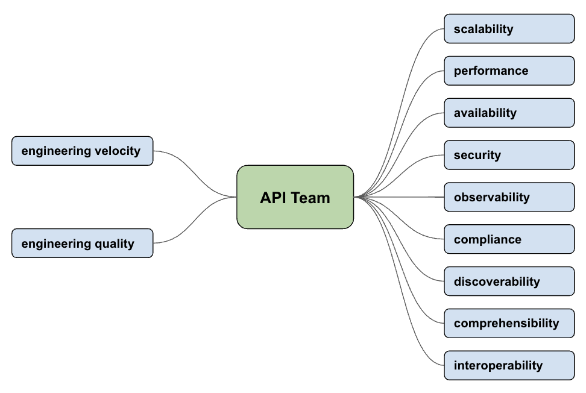
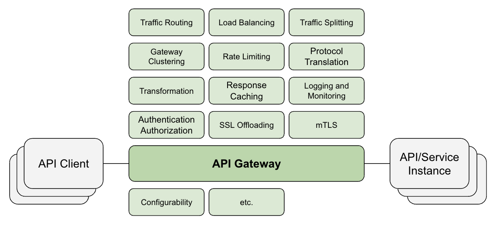
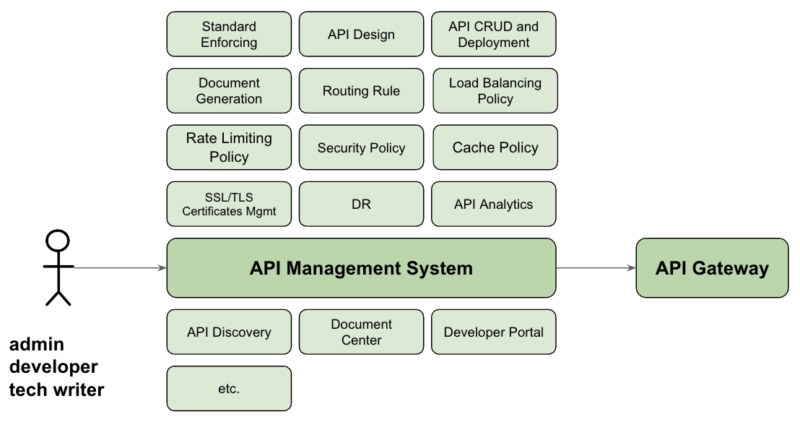

# Addressing API Challenges with Gateway and Management System

APIs play a critical role in modern software development, enabling seamless integration across applications. As the 
demand for robust and efficient APIs grows, API teams need to address many concerns to ensure the successful 
development, deployment, and management of their APIs. In this article, we will explore the key challenges an API team 
needs to address and how API gateway and management system can help.  

## The Challenges

Let's begin with the key challenges an API team faces on daily basis, without getting into the specifics for now.

## API Gateway

An API Gateway is a server that acts as an intermediary between API clients (such as web or mobile applications) and 
backend service instances. Its primary function is to route API requests to the appropriate backend services, but it 
can also provide additional features to enhance and manage APIs.

Some of these features include:
- **Traffic Routing**: Routing incoming requests to the appropriate backend services based on various factors such as 
URL patterns, client metadata, request content.
- **Load Balancing**: Distributing traffic among multiple backend services to ensure high availability and optimal 
performance.
- **Traffic Splitting**: Splitting and routing incoming requests to different clusters of backend services based on 
predefined ratio.
- **Gateway Clustering**: Having multiple API gateway instances to form a cluster serving client traffic.
- **Rate Limiting**: Controlling the number of requests a client can make to an API within a specific timeframe to prevent 
overloading the backend services.
- **Protocol Translation**: Translating between different API protocols (e.g., REST, SOAP, or GraphQL) or messaging
protocols (e.g., HTTP, HTTPS, or WebSocket), allowing clients to use their preferred communication methods while
interacting with backend services.
- **Transformation**: Transforming data formats between clients and backend services. For example, an API gateway can
  convert XML data from a legacy SOAP-based backend service to JSON for a modern client application and vice versa.
- **Response Caching**: Storing frequently requested data to reduce the load on backend systems and improve response 
times.
- **Logging and Monitoring**: Tracking API usage, performance, and errors to facilitate troubleshooting and analytics.
- **Authentication and Authorization**: Verifying the identity of API clients and controlling their access to specific 
endpoints based on predefined policies.
- **SSL Offloading**: Decrypting incoming SSL/TLS encrypted traffic before forwarding it to backend services and 
encrypting response from backend services before sending to client.
- **mTLS (mutual TLS)**: Requiring both the client and the server to authenticate each other's identities and ensuring 
that only trusted clients can access the API.
- **Configurability**: Offering the ability, typically in the form of administration API, to manage and configure API 
gateway, including routing rules, load balancing algorithms and policies, security policies, etc., etc.

## API Management System

An API management system is a suite of tools and services designed to help organizations create, publish, maintain, 
monitor, and secure their APIs. It typically includes features like API design, documentation, versioning, analytics, 
and developer portal, as well as API access control and rate limiting. The goal of an API management system is to 
simplify the process of building and maintaining APIs while providing visibility into their usage and performance.

Key components of an API management system include:

- **API design and documentation**: Tools to define, design, and document APIs, often using specifications like OpenAPI.
- **API lifecycle management**: Support for creating, publishing, and versioning APIs, as well as deprecating and 
retiring them.
- **API analytics and monitoring**: Insights into API usage, performance, and errors, enabling organizations to 
identify and address potential issues.
- **Developer portal**: A centralized platform for API consumers (developers) to discover, learn about, and access APIs,
typically including API documentation, authentication information, and usage examples. 
- **API access control and security**: Features to define and enforce policies for API access, authentication, and 
authorization, as well as rate limiting and quota management.

API management system and API gateway are two different components of an API infrastructure that serve distinct purposes
but often work together to create a comprehensive API management solution. As one might expect, API management system 
interacts with API gateway, either directly or indirectly, to configure gateway instances and retrieve API logs/metrics. 
This collaboration allows for seamless management of API traffic and provides valuable insights into API usage, 
performance and errors.

## How API gateway and management System helps address the challenges

### Scalability

APIs need to be scalable to handle changing volume of traffic and demand.  

API gateways can help by providing load balancing, response caching, rate limiting, traffic splitting capabilities, 
ensuring that APIs can scale horizontally to accommodate growing traffic.  

API management systems can work with API gateway to offer auto-scaling features, allowing API infrastructure to adapt to 
demand automatically.

### Performance

API performance directly affects user experience and application responsiveness.  

API gateways can help optimize performance by implementing efficient caching, protocol translation, request/response 
compression, and data transformation.  

API management systems can provide performance monitoring tools to track API performance and identify potential 
bottlenecks.

### Availability

High availability is crucial for APIs, as downtime can lead to a loss of revenue, reputation, and customer trust.  

API gateways can improve availability by implementing redundancy, fault tolerance, throttling and backup strategies 
through load balancing, rate limiting, backend service marking down, traffic routing and traffic splitting.  

API management systems can provide monitoring and alerting tools to detect and resolve issues before they impact users
or their impact goes wild. They can also reconfigure API gateway to reroute and redirect traffic based on DR strategy 
backed with multiple clusters/availability zones.

### Security

API security is paramount to protect sensitive data and prevent unauthorized access.  

API gateways can help enforce strong authentication and authorization mechanisms, such as OAuth or API keys, and apply 
encryption for data in transit. They can also integrate with third-party security systems to provide additional 
protection against threats like DDoS attacks and data breaches.  

API management systems can assist in performing regular security audits, vulnerability assessments, and ensuring 
adherence to security best practices. 

### Observability

API observability is crucial for maintaining high-performance, highly available, and secure API ecosystems. It enables 
API teams to proactively identify and resolve issues, optimize resource allocation, and make data-driven decisions.

API gateways generate detailed logs for each API request and response, including metadata such as timestamps, client 
IPs, and response codes. This information aids in debugging, troubleshooting, and understanding client behavior and 
traffic patterns. Some API gateways support distributed tracing, allowing teams to trace individual requests across 
multiple services and components. This helps in identifying performance issues and understanding the dependencies 
between various applications.

API management systems aggregate and analyze the data collected from API gateways, providing valuable insights into 
usage patterns, trends, and performance bottlenecks. Then can send out alerts or notifications based on predefined 
conditions, such as when specific error rates or response time thresholds are exceeded.

### Compliance

API teams must ensure compliance with legal and regulatory requirements related to data privacy, security, and industry-
specific standards.  

API management systems help maintain compliance with industry standards and regulations by providing tools for auditing, 
logging, and monitoring API usage. These tools can help organizations track and report on compliance-related activities, 
ensuring adherence to legal and regulatory requirements.

## Discoverability

API discoverability is essential to enable developers to find and use your APIs effectively and also to enable API 
clients to locate and access the API endpoints.

API gateways and/or API management systems can provide a central platform for documenting and publishing APIs, making 
it easier for developers to search, discover and use them. This enhances collaboration, reduces duplication of effort, 
and improves overall engineering velocity.

### Comprehensibility

An easy-to-understand API is more likely to be adopted and used correctly by developers. 

API management systems can help improve comprehensibility by adopting standard like OpenAPI specification, enforcing 
consistent API design, providing tools for generating and maintaining documentation, and promoting best practices in 
API development. This ensures that APIs are easy to understand, reducing the learning curve for developers.

## Interoperability

Interoperability is crucial to ensure that APIs can be easily integrated with various systems and platforms.  

API gateways can help facilitate seamless integration by supporting widely accepted standards, such as REST, GraphQL, 
or gRPC, and offering standard data formats like JSON or XML through protocol translation and data transformation. They 
can also extend the support of integration with diverse backend systems through plugin mechanisms.

## Engineering Velocity

API teams need to maintain a high engineering velocity to stay competitive, reduce time-to-market time, deliver value 
to their users and businesses.

API management systems can help improve engineering velocity by providing automation tools for development, deployment, 
and monitoring processes, documentation generation, as well as reusable components and templates. They help adopt, 
enforce and promote standards for API design and documentation. All these frees up developers to focus on writing code, 
reducing the time it takes to deliver new features and enhancements.

### Engineering Quality

Ensuring high engineering quality is essential to prevent issues, minimize technical debt, and maintain a reliable API. 

API gateways and management systems can help maintain high engineering quality by offering tools and features that help 
improve the quality of API development, such as automated testing, versioning and change management. These features 
ensure that APIs are reliable, stable, and maintainable, reducing the likelihood of errors and downtime.

## In Conclusion

API gateways and management systems play a critical role in addressing the key concerns of API teams. By leveraging 
these tools, organizations can ensure that their APIs are scalable, performant, secure, and compliant, while also 
improving developer productivity and overall engineering quality.
