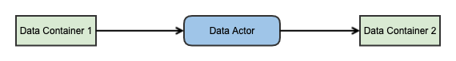
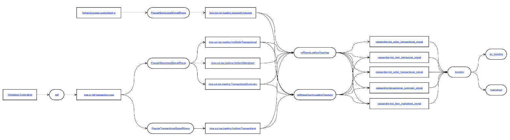

# Some thoughts on data topology

## Through entangled weeds in data world

If you are someone who has been working on big data area for a while, you must have been dealing with following questions day in and day out. 

- where is the data stored?
- where does the data come from?
- which part generates the data?
- what is the schema of the data?
- which systems consume the data?
- is the job processing the data healthy?
- what kind of processing is applied to the data?
- ...

In the place I work for, it's always easy to get a straight answer to any of the questions. Actually, in many cases, it's like crawling 
through a patch of entangled weeds to get an answer. I think there are many reasons.
- so many technologies involved
  - for storing data, HDFS, Teradata, Swift, Cassandra, Couchbase, Mongo, Elasticsearch, etc.
  - for processing data, Hadoop MapReduce (obsolete but legacy is there), Spark, Flink, Storm, Teradata SQL, script-driven, etc.
- so many components involved
  - often written in different languages
  - often run on different platforms
  - many you and your team don't have control
- information and knowledge are scattered
  - among different forms of documents
  - among codes in different code base

I have been looking for something that can not only given straight answers to most of the questions, but also provide a more complete view
 with enough clarity on how data flows through the components, include those in upstream team's control, those in my team's scope, those in 
downstream team's territory. Better yet, you can use it to monitor as a whole.

But so far no satisfactory finding. Orchestration solutions like UC4, Spring Cloud DataFlow, AirFlow, are probably the most closest ones, 
they could provide very nice view of work flow, showing processing steps and DAG, but they don't help too much w.r.t answering questions 
like where the data is stored or what is the schema, and they can't tell anything goes beyond what's orchestrated and scheduled.

So I've been thinking about how to build such a something and also doing some research, the result is some idea called data topology, which 
might worth sharing. 

## Idea of data topology

First of all, I need to make it very clear, data topology is a reflection of running system in data flow from start to end, not running 
system itself.

Data topology is formed around 3 basic elements.

- data actor, which is reflection/representation of running unit does something about data, with storing/containing data excluded.
- data container, which is reflection/representation of entity which contains data, could be a Kafka Topic, or a Cassandra table in a 
keyspace, a Couchbase bucket, a HDFS file within a directory, a HIVE table, a OpenSwift container, an Elasticsearch index, a MySQL table, 
etc.
- arrow, an arrow not only represents data flow direction, but also reflects the coupling/connection between two components, either actor or
container.

Here are the explanation on how everything works.
- data actor can connect data container or data actor
- data container cannot connect data container
- one data actor can connect with multiple data containers and or multiple data actors
- arrow indicates data flow and direction, when data flows through a data actor, some processing happens, it could be as simple as copying
- an arrow leading out of a data container means data flows out of the data container
- an arrow leading into a data container means data flows into the data container
- an arrow leading into a data actor means the data actor takes in data then process it
- an arrow leading out of data actor means the data actor finishes processing then lets processed data flows toward downstream component
- data actor can have many information attached, such as underlying system information, setting of connection to data container or another 
data actor, how to probe itself and connectivity what kind of processing it applies to data flowed-in, link to source code, etc.
- data container can also have many information attached, such as cluster information, how to probe cluster, DDL scripts, data schemas, 
how to inspect data contained, etc.

Below is one sample data topology as a reflection of real data processing runtime, data service and end data consuming application, without 
revealing details.

## Summary

The idea of data topology described here is one step closer to what I have been looking for. 
- it could provide a more complete picture of a running data system
- it could capture/bring key information together, hence provide easy access

Next step is probably to work on a PoC.